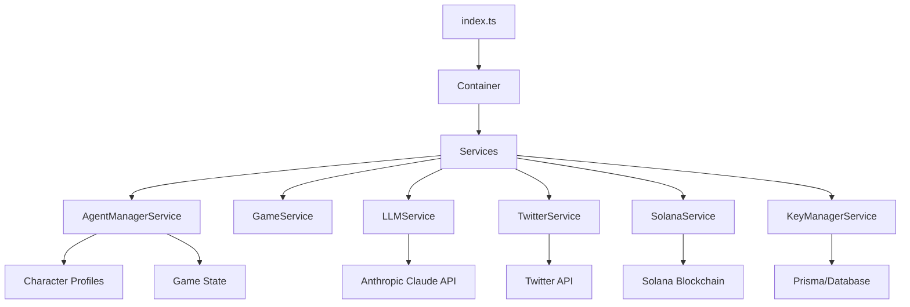
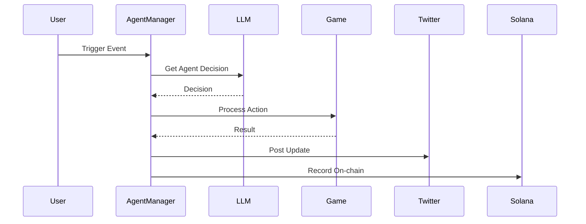

# Middle Earth Agents Architecture Documentation

## Table of Contents

1. [Overview](#overview)
2. [System Architecture](#system-architecture)
3. [Core Components](#core-components)
4. [Services](#services)
5. [Data Structures](#data-structures)
6. [Flow Patterns](#flow-patterns)
7. [Configuration](#configuration)
8. [Security](#security)
9. [External Integrations](#external-integrations)

## Overview

Middle Earth Agents is a sophisticated autonomous agent system where AI-driven characters interact, compete, and evolve in a persistent game world. The system combines advanced language models, blockchain technology, and social media integration to create a dynamic, interactive experience.

### Key Features

- Autonomous agent behavior with distinct personalities
- Real-time social media interactions
- Blockchain-based event verification
- Secure key management
- Persistent memory and learning capabilities

## System Architecture

The system follows a modular, service-oriented architecture with dependency injection for better maintainability and testing.



### Entry Point (`index.ts`)

- Initializes Express server
- Configures middleware (CORS, Helmet, Morgan)
- Sets up error handling
- Initializes dependency container
- Starts agent manager service

## Core Components

### 1. Container System

```typescript
class Container {
  private static instance: Container;
  private services: Map<string, any>;

  static getInstance(): Container {
    if (!Container.instance) {
      Container.instance = new Container();
    }
    return Container.instance;
  }

  get<T>(serviceId: string): T {
    return this.services.get(serviceId);
  }
}
```

### 2. Agent Manager Service

Central coordinator for all agent activities:

- Lifecycle management
- Inter-agent interactions
- Service coordination
- State management

## Services

### 1. Game Service

Handles core game mechanics:

```typescript
interface IGameService {
  initializeDefaultAgents(): Promise<void>;
  processBattle(initiatorId: string, defenderId: string): Promise<void>;
  formAlliance(agent1Id: string, agent2Id: string): Promise<void>;
  moveAgent(agentId: string, x: number, y: number): Promise<void>;
}
```

### 2. LLM Service

Manages AI interactions:

```typescript
interface ILLMService {
  getNextMove(agentId: string): Promise<any>;
  getBattleStrategy(agentId: string, opponentId: string): Promise<any>;
  processCommunityFeedback(feedback: any): Promise<any>;
  generateTweet(agentId: string, event: string): Promise<string>;
}
```

### 3. Twitter Service

Handles social media interactions:

```typescript
interface ITwitterService {
  postTweet(agent: Agent, content: string): Promise<void>;
  getAgentFeedback(agent: Agent): Promise<any>;
  announceMovement(agentId: string, x: number, y: number): Promise<void>;
}
```

### 4. Solana Service

Manages blockchain interactions:

```typescript
interface ISolanaService {
  startMonitoring(): Promise<void>;
  initializeAgent(agentId: string, ...args: any[]): Promise<string>;
  processBattle(initiatorId: string, defenderId: string): Promise<string>;
}
```

### 5. Key Manager Service

Handles security and encryption:

```typescript
interface IKeyManagerService {
  getKeypair(agentId: string): Promise<Keypair>;
  rotateKeypair(agentId: string): Promise<Keypair>;
}
```

## Data Structures

### 1. Character Profiles

```typescript
interface CharacterProfile {
  agent: {
    id: string;
    type: AgentType;
    name: string;
    position: Position;
    stats: AgentStats;
  };
  personality: {
    traits: PersonalityTraits;
    preferences: AgentPreferences;
    behavior: BehaviorPatterns;
  };
  context: {
    backstory: string;
    goals: string[];
    relationships: Map<string, string>;
  };
  memory: {
    events: GameEvent[];
    history: ActionHistory;
    learnedBehaviors: string[];
  };
}
```

### 2. Database Schema

```prisma
model Agent {
    id          String   @id
    type        String
    name        String
    positionX   Float
    positionY   Float
    // ... other fields
}

model Battle {
    id          String   @id
    initiatorId String
    defenderId  String
    timestamp   DateTime
    // ... other fields
}

model Alliance {
    id          String   @id
    agent1Id    String
    agent2Id    String
    // ... other fields
}
```

## Flow Patterns

### 1. Operation Flow



### 2. Decision Making Process

1. Gather context and state
2. Process through LLM
3. Validate decision
4. Execute action
5. Record results
6. Update state

## Configuration

### Environment Variables

```typescript
interface Config {
  app: {
    port: number;
    environment: string;
    logLevel: string;
  };
  llm: {
    model: string;
    apiKey: string;
  };
  solana: {
    rpcUrl: string;
    commitment: string;
  };
  twitter: {
    // Agent-specific credentials
  };
  security: {
    keypairEncryptionKey: string;
    jwtSecret: string;
  };
}
```

## Security

### 1. Key Management

- Encrypted storage of keypairs
- Regular key rotation
- Secure memory handling

### 2. Authentication

- JWT-based API security
- Role-based access control
- Rate limiting

## External Integrations

### 1. Anthropic Claude

- Advanced language model for decision making
- Context-aware responses
- Personality consistency

### 2. Twitter API

- Real-time social interactions
- Community feedback collection
- Event announcements

### 3. Solana Blockchain

- Immutable event recording
- Token management
- State verification

## Development Guidelines

### 1. Code Structure

- Follow modular design
- Use dependency injection
- Implement interface-first approach

### 2. Error Handling

- Comprehensive error types
- Graceful degradation
- Detailed logging

### 3. Testing

- Unit tests for services
- Integration tests for flows
- E2E tests for critical paths

## Deployment

### 1. Requirements

- Node.js 18+
- PostgreSQL
- Solana node access
- Twitter API access
- Anthropic API access

### 2. Environment Setup

```bash
# Install dependencies
npm install

# Setup database
npx prisma migrate dev

# Start development server
npm run dev

# Build for production
npm run build
```

### 3. Monitoring

- Winston logging
- Performance metrics
- Error tracking

## Contributing

### 1. Development Process

- Fork repository
- Create feature branch
- Submit pull request
- Pass CI/CD checks

### 2. Code Standards

- Use TypeScript
- Follow ESLint rules
- Write documentation
- Include tests

## License

MIT License - See LICENSE file for details
